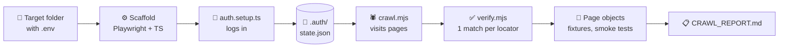

<div align="center">

# 🦴 pw-backbone

**Point it at a web app. Get a Playwright Page Object Model project back.**

[](https://playwright.dev)
[](https://www.typescriptlang.org)
[](https://claude.com/claude-code)


[How it works](#-how-it-works) · [Quick start](#-quick-start) · [Generate](#-generate-a-new-project) · [Update](#-update-an-existing-project) · [Output](#-what-you-get)

</div>

---

A **generator** that creates and maintains Playwright TypeScript **Page Object Model** projects.
Claude Code logs in with a generated auth script, crawls the app read-only, then writes page objects, shared components, fixtures and smoke tests into a **target folder** you choose.
All the rules it follows live in [`CLAUDE.md`](CLAUDE.md).

| | |
|---|---|
| 🗂️ **Generator only** | This repo holds the rules. Each app gets its own target folder. |
| 🔐 **Credentials stay yours** | They live in the target's `.env`. Claude never reads them or asks for them in chat. |
| 👀 **Read-only crawl** | Never submits forms or clicks Save, Delete, Submit, Confirm, Approve or Logout. |
| 🎯 **Stable locators** | `getByTestId` › `getByRole` › `getByLabel` › `getByPlaceholder` › CSS. Each one is checked to match exactly one element. |
| 🛡️ **Safe updates** | Re-runs fix broken locators and never delete your code. |

## 🔄 How it works



## 🚀 Quick start

> Already set up? Three steps.

```powershell
cd <path>\pw-backbone
claude
```

Then type **`Start a session per CLAUDE.md.`** and answer the questions.

<details>
<summary><b>🧰 First-time setup (Windows / PowerShell)</b>: once per machine</summary>

<br/>

**1. Node.js 18+**: install the LTS version from https://nodejs.org, then check:
```powershell
node -v
```

**2. Git for Windows** (Claude Code needs it): install from https://git-scm.com/download/win, then check:
```powershell
git --version
```

**3. Claude Code**: install, then check:
```powershell
irm https://claude.ai/install.ps1 | iex
claude --version
```

**4. Log in** with your company Claude account:
```powershell
claude
```
Inside Claude Code, run `/login`, choose **Claude account with subscription**, and sign in with your work email.
Run `/status`. **Login method** should show your Team account. Exit with `/exit`.

**5. Get the generator:**
```powershell
git clone <repo-url> pw-backbone
cd pw-backbone
```

**6. Register the Playwright MCP** inside the pw-backbone folder:
```powershell
claude mcp add playwright -- cmd /c npx @playwright/mcp@latest
claude mcp list
```
`playwright` should show **Connected**.

**7. Test the browser.** Start `claude` and type:
```
Use the playwright MCP to open https://example.com and tell me the page title.
```
A browser opens and Claude replies `Example Domain`. ✅ Setup is done.

</details>

## ✨ Generate a new project

**1️⃣ Create the target folder** with only a `.env` file in it:

```env
BASE_URL=https://your-app-url
APP_USER=your-username
APP_PASS=your-password
```

> [!IMPORTANT]
> You write this file yourself. Claude reads only `BASE_URL` and never sees the username or password.

**2️⃣ Start Claude Code** in the generator folder and type `Start a session per CLAUDE.md.`

**3️⃣ Answer the questions:**

| Question | Answer |
|---|---|
| Mode | `NEW` |
| Target folder | Absolute path, e.g. `C:\Users\<you>\Documents\GitHub\my-app-tests` |
| Page limits | Default: depth 3, 30 pages |

If Claude asks for access to the target folder, allow it (CLI: `/add-dir <target folder path>`).

**4️⃣ Confirm the plan.** Claude then:
- ⚙️ scaffolds the Playwright project in the target folder
- 🔑 generates `tests/auth.setup.ts` and runs it, which logs in and saves the session to `.auth/state.json`
- 🕷️ crawls the app with that saved session and writes page objects, fixtures and smoke tests
- 🧪 runs the type check and the smoke tests and reports the results

**5️⃣ Review** `CRAWL_REPORT.md` in the target folder.

> [!TIP]
> On a new app, start with small limits (depth 1, 5 pages) to check the output quality before a full crawl.

## 🔁 Update an existing project

Same steps, but choose mode **`UPDATE`** and give the existing target folder.

| What Claude finds | What it does |
|---|---|
| 🔧 Broken locator | Replaces it with a new one, following the locator priority |
| ➕ New element or page | Adds the locator or page object, fixture and smoke test |
| ❓ Element no longer on the page | Keeps it and marks it `// TODO: not found in last crawl` |
| 🚫 Page no longer reachable | Keeps the files and lists the page in the report |

Results go in the target folder's `UPDATE_REPORT.md`. **Nothing is ever deleted.**

> [!NOTE]
> Commit the target project before an update so you can review the changes with `git diff`.

## 📦 What you get

```
<target>/
├── pages/              <PageName>Page.ts: one class per page (locators, goto(), actions)
├── components/         shared parts: header, sidebar, modals
├── fixtures/           pages.ts: test extended with page-object fixtures
├── tests/
│   ├── auth.setup.ts   logs in and saves the session to .auth/state.json
│   └── smoke/          <page>.spec.ts: key elements are visible
├── .crawl/             crawl.mjs / verify.mjs helpers (output/ is git-ignored)
├── .auth/              saved session (git-ignored)
├── .env                BASE_URL + credentials (git-ignored, you create it)
├── .env.example        placeholder keys (safe to commit)
├── README.md           how to run this project's tests
└── CRAWL_REPORT.md     pages found, unstable locators, skipped pages
```

<details>
<summary><b>👀 Example generated page object</b></summary>

<br/>

```ts
import { type Page, type Locator } from '@playwright/test';

export class UsersListPage {
  readonly searchInput: Locator;
  readonly addUserButton: Locator;
  readonly usersTable: Locator;

  constructor(readonly page: Page) {
    this.searchInput = page.getByPlaceholder('Search users');
    this.addUserButton = page.getByRole('button', { name: 'Add user' });
    this.usersTable = page.getByTestId('users-table');
  }

  async goto() {
    await this.page.goto('/users/list');
  }

  async search(text: string) {
    await this.searchInput.fill(text);
  }
}
```

</details>

### ▶️ Run the tests (in the target folder)

| Command | What it does |
|---|---|
| `npm run auth` | Log in again and refresh `.auth/state.json` when the session expires |
| `npm run typecheck` | `tsc --noEmit` |
| `npm run test:smoke` | Smoke tests, chromium only |
| `npm test` | All tests |
| `npm run test:ui` | Playwright UI mode |
| `npx playwright show-report` | Open the last HTML report |

## ✍️ Protecting manual code

Edit generated files freely. Update runs never touch anything wrapped in markers:

```ts
// MANUAL START
async createUserWithDefaults() { /* your code */ }
// MANUAL END
```

Update runs also keep methods, assertions and tests they didn't generate. They only rename an element when its meaning has changed, and they list every rename in `UPDATE_REPORT.md`.

---

<div align="center">
<sub>🗂️ This repo: <code>CLAUDE.md</code> (the rules) · <code>README.md</code> (this file) · <code>.gitignore</code></sub>
</div>
